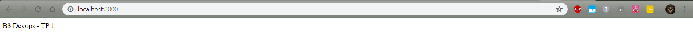

# B3 Devops - TP 1

## Info

**mail**: antinea.gontard@ynov.com

**github_username**: Maengast

## Prérequis
- Virtual Box 6.0
- Vagrant
- Bash terminal

## 1ère Partie
  #### Installation OS
  - Télécharger Ubuntu Server
  - Lancer Virtual Box et crée une nouvelle machine virtuelle . RAM (1GB)
  - L'image disque n'étant pas demandée pendant la création il faut l'ajouter après. Configuration -> Stockage.
  - Lance la machine fraichement crée.
  
  #### Installation des Packages
  - Pendant l'installation, installer open-ssh server lorsque cela est demandé.
  - Installer les packages NodeJS et Nginx : 
      > apt-get install nodejs 
      > apt-get install nginx
      
  #### Ports forward
  - Recupération de l'addresse IP de la machine
      > ip a s
      
  - Configuration des ports forward (Configuration -> Reseau -> Avancé -> Redirection des ports)
  
    | Rules | Protocole | IP hôte | Port hôte | IP invité | Port invité |
    |-------|-----------|---------|-----------|-----------|-------------|
    | ssh | TCP | 127.0.0.1 | 2222 | (IP Machine) | 22 |
    | http | TCP | 127.0.0.1 | 8000 | (IP Machine) | 80 |
    | https | TCP | 127.0.0.1 | 4443 | (IP Machine) | 443 |
  
  #### Configuration Nginx
  - Acceder au dossier utiliser par le seveur Web
    > cd /var/www/html
    
  - Crée un index.html 
    > nano index.html
    
  - Editer le fichier comme suit :
  ``` <!DOCTYPE html>
      <html>
      <body>
      B3 Devops - TP 1
      </body>
      </html>
   ```
  
  #### Test
  - Pour tester que tous marche : http://localhost:8000/
  
  
## 2ème Partie
  
  #### Crée la VM
  - Télécharger et installer Vagrant
  - Crée un Vagrantfile et le configurer
    > vagrant init
    
  #### Lancer la VM
  > vagrant up
 
